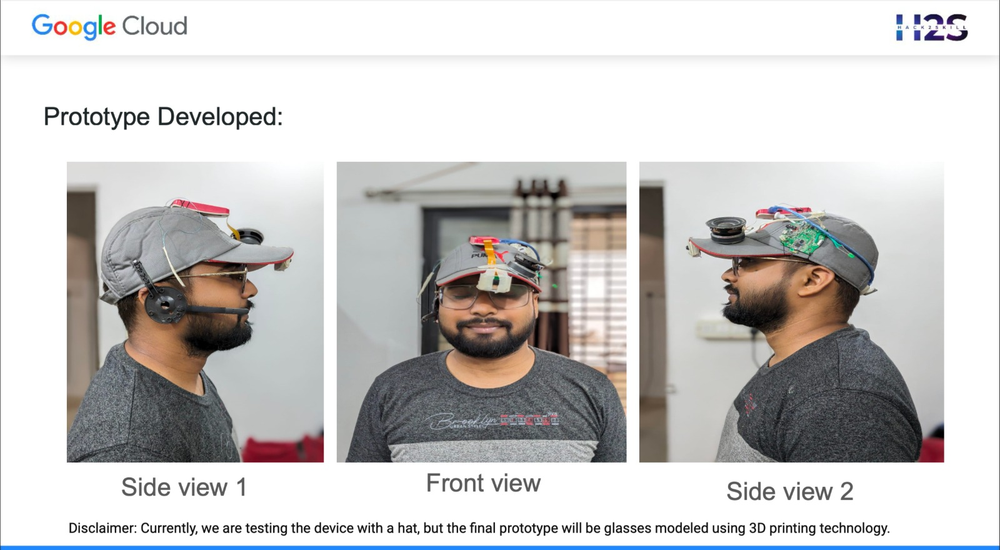
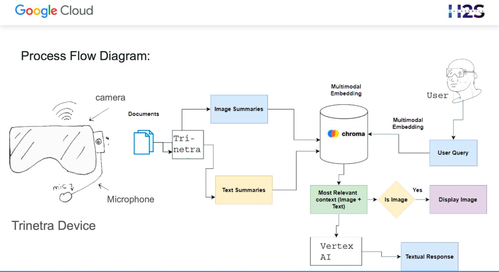

# Trinetra: Personalized Learning Smart Goggles

## Team X-Factor

Welcome to Trinetra, your gateway to personalized learning experiences powered by Gemini AI. Trinetra is a cutting-edge solution designed to cater to diverse learning needs, offering tailored tools and features to enhance understanding and productivity.

### Team Members :

1. Suyog Buradkar
2. XYZ
3. XYZ

### Challenge Description : 
In a landscape marked by diverse learning requirements, Trinetra endeavors to redefine the acquisition of knowledge. It aspires to transform the educational paradigm, catering to individuals of varying learning speeds, including those engaged in content creation, research endeavors, or facing challenges associated with visual impairments. Trinetra stands as a beacon of support, fostering inclusivity and accessibility in the pursuit of enlightenment. 

With its innovative approach, Trinetra seeks to empower learners across all spectrums, facilitating a seamless journey towards intellectual growth and development. Welcome to a realm where learning knows no bounds, and Trinetra illuminates the path to enlightenment.

### Product Features :

**(A) Personalized Learning:** Trinetra offers tailored learning experiences that adapt to individual paces and preferences, ensuring optimal comprehension and retention.
Content Creation: Our platform provides streamlined tools designed specifically for bloggers, enabling efficient article writing and content generation processes, thereby enhancing productivity and creativity.

**(B) Data Collection:** Trinetra simplifies the process of capturing and transcribing information for research purposes, facilitating seamless data collection and analysis, ultimately leading to deeper insights and informed decision-making.

**(C) Accessibility:** With features such as text-to-speech and image description capabilities, Trinetra caters to the needs of visually impaired individuals, empowering them to access and engage with content effortlessly, thus promoting inclusivity and equal opportunities for learning.
Trinetra is committed to providing a comprehensive and user-centric solution that addresses diverse learning needs while fostering accessibility, efficiency, and innovation.

### Potential Applications : 

Trinetra isn't just limited to personalized learning. Explore its potential across various domains:

**(A) Quality Control:** Trinetra can be utilized to detect defects in manufacturing processes, ensuring high-quality standards are maintained throughout production.

**(B) Inspection:** Across various industries, Trinetra aids in detailed inspections, identifying structural defects in buildings, infrastructure, or machinery for improved safety and reliability.

**(C) Agriculture:** Farmers can benefit from Trinetra's image analysis features to identify plant diseases, pest infestations, and other issues affecting crop health, leading to timely interventions and increased yields.

**(D) Education:** Trinetra supports educators by analyzing student responses, enabling targeted interventions and support for improved learning outcomes.

**(E) Content Writing:** Bloggers can enhance their productivity with Trinetra's assistance, which suggests topics, generates outlines, and drafts content based on input, streamlining the content creation process for increased efficiency.

### Technology Used : 

Trinetra utilizes cutting-edge technology to facilitate its operations, including:
**(A) Camera :** An 8MP HDR Camera, enabling the capture of highly detailed images with support for streaming.

**(B) Audio Microphone :** An HDR Audio Microphone, allowing for seamless interaction through voice commands.

**(C) Cloud Service :** An Android/Desktop App, meticulously integrated with Google Cloud to leverage Vertex AI APIs for enhanced functionality.

**(D) Multimodal RAG Model:** The Multimodal RAG Model, adept at summarizing content extracted from images recorded by the device's camera.

**(E) Vector Database :** A sophisticated Vector Database, adept at storing image and text embeddings for subsequent processing and analysis.

**(F) Gemini Models :** Gemini-pro Models, strategically employed for the comprehensive summarization of both image and text data, ensuring efficiency and accuracy in information processing. These technologies collectively empower Trinetra to deliver personalized learning experiences with unparalleled precision and effectiveness.

### Provided Solutions :

**(A) Snapshot Capture:** Trinetra allows users to effortlessly capture snapshots of information that they find important, facilitating quick and convenient access to relevant content whenever needed.

**(B) Vector Embeddings:** Utilizing vector embeddings, Trinetra ensures efficient storage of information, enabling optimized data organization and retrieval processes for enhanced user experience and performance.

**(C) Q/A Audio Chatbot:** Enhancing communication capabilities, Trinetra features a sophisticated Q/A audio chatbot powered by advanced language models like LLM (Large Language Models) or RAG (Retrieval-Augmented Generation). This chatbot facilitates seamless interaction, enabling users to ask questions, receive relevant answers, and engage in meaningful conversations effortlessly.

**(D) Vertex AI Integration:** Leveraging the power of Vertex AI, Trinetra comprehends information gathered from various sources such as images, videos, and text with remarkable accuracy and efficiency. This integration not only saves users valuable time but also enhances their capabilities in content creation, comprehension, and personalized learning endeavors.

### Prototype : 
Check out our prototype in action! 

### Process Flow Diagram :

Here is the working process flow diagram of Trinetra :

**(A) Input Acquisition:** The Trinetra device captures input in various forms such as audio, video, and images through its camera and audiophone functionalities.

**(B) Data Conversion:** The captured input is then converted into structured documents for further processing and analysis.

**(C) Summarization:** Next, summaries of the converted data are generated to distill key insights and information from the input.

**(D) Vector Database Storage:** These summaries, along with the original data, are stored in a vector database. This database utilizes multimodal embedding techniques to represent both textual and visual information in a unified manner.

**(E) Query Submission:** When a user submits a query, it is contextualized with relevant image and text data from the vector-embedded database, ensuring that the query aligns with the context of the available information.

**(F) Contextualization with Vertex AI:** The contextualized query, along with the associated data, is passed to Vertex AI, a powerful multimodal language model. This model leverages advanced machine learning techniques to understand the context and semantics of the query within the available data.

**(G) Textual Response Generation:** Based on the contextualized query and the underlying data, Vertex AI generates a textual response that provides relevant and meaningful insights to the user, helping them to better understand and interpret the information captured by the Trinetra device.

In essence, the Trinetra device seamlessly integrates input capture, data processing, contextualization, and response generation to deliver an intuitive and informative user experience.

### Video Tutorial : 
Check out our prototype in action! [Insert link to prototype video]

### Support : 
For any inquiries or assistance, feel free to reach out to us at [email@example.com].

### Contributors
1. XYZ
2. XYZ

