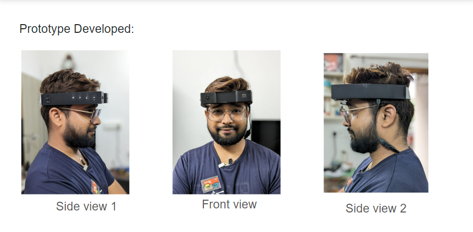
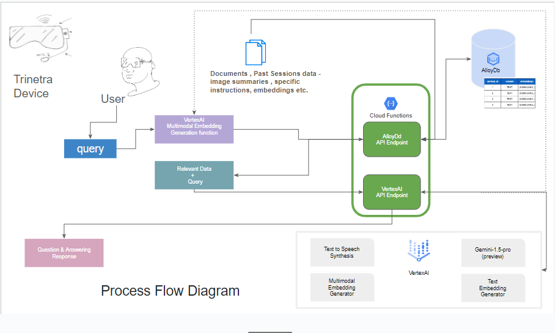
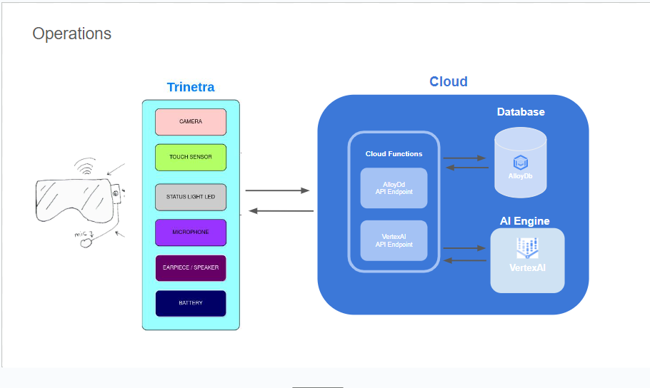

# Trinetra: Personalized Learning Smart Goggles

## Team X-Factor

Welcome to Trinetra, your gateway to personalized learning experiences powered by Gemini AI. Trinetra is a cutting-edge solution designed to cater to diverse learning needs, offering tailored tools and features to enhance understanding and productivity.

### Challenge Description : 
In a landscape marked by diverse learning requirements, Trinetra endeavors to redefine the acquisition of knowledge. It aspires to transform the educational paradigm, catering to individuals of varying learning speeds, including those engaged in content creation, research endeavors, or facing challenges associated with visual impairments. Trinetra stands as a beacon of support, fostering inclusivity and accessibility in the pursuit of enlightenment. 

With its innovative approach, Trinetra seeks to empower learners across all spectrums, facilitating a seamless journey towards intellectual growth and development. Welcome to a realm where learning knows no bounds, and Trinetra illuminates the path to enlightenment.

### Product Features : 
Trinetra leverages advanced Google Cloud technologies to provide a tailored, efficient, and inclusive educational platform. Here are the key features of our product, enhanced by Google's powerful services:

**(A) Personalized Learning:**

Trinetra offers personalized learning experiences that adapt to individual learning paces and preferences, ensuring optimal comprehension and retention. This is made possible by integrating **Vertex AI Multimodal API**, which allows our platform to understand and process various forms of data, adapting content dynamically to meet user needs. This integration supports sophisticated content creation tools designed specifically for bloggers, enabling them to write articles and generate content more efficiently, thereby enhancing productivity and creativity.

**(B) Data Collection:**

Our platform simplifies the process of capturing and transcribing information, which is crucial for research purposes. By incorporating **Google's Speech-to-Text API** powered by the Chirp model, Trinetra facilitates seamless audio to text conversion, enhancing data collection and analysis. This leads to deeper insights and more informed decision-making, supported further by **AlloyDB**, which provides a scalable and highly available database service optimized for advanced data analysis.

**(C) Accessibility:**

Trinetra is committed to inclusivity and equal opportunities for learning. Features such as text-to-speech and image description capabilities are significantly enhanced by Google's APIs. *Google's Text-to-Speech API* converts text into natural-sounding speech, allowing visually impaired users to listen to the content easily. Furthermore, the integration of image recognition technologies through Google's APIs enables descriptions of visual content, making our platform more accessible to users with visual impairments.

### How Trinetra Stands Out :
Trinetra is not just another educational platform; it's a standalone device designed to revolutionize learning. Unlike Meta Goggles and similar devices, Trinetra operates as a standalone device. It requires only Wi-Fi connectivity for internet access, eliminating the need for complicated setups or additional dependencies.

### Technology Used : 

Trinetra utilizes cutting-edge technology to facilitate its operations, including:

**(A) Camera :**  An 8MP HDR Camera, enabling the capture of highly detailed images with support for streaming.

**(B) Audio Microphone :**  An HDR Audio Microphone, allowing for seamless interaction through voice commands.

**(C) Cloud Service :**  An Android/Desktop App, meticulously integrated with Google Cloud to leverage Vertex AI APIs for enhanced functionality.

**(D) Multimodal RAG Model:**  The Multimodal RAG Model, adept at summarizing content extracted from images recorded by the device's camera.

**(E) Vector Database :**  A sophisticated Vector Database, adept at storing image and text embeddings for subsequent processing and analysis.

**(F) Gemini Models :**  Gemini-pro Models, strategically employed for the comprehensive summarization of both image and text data, ensuring efficiency and accuracy in information processing. These technologies collectively empower Trinetra to deliver personalized learning experiences with unparalleled precision and effectiveness.

### Overview of Google Services used in Trinetra

**(A) Vertex AI:** 

As Trinetra heavily relies on machine learning models and AI capabilities to power its generative responses, Vertex AI serves as the foundational platform for training, deploying, and customizing these models. It facilitates the development and optimization of language models used within Trinetra, ensuring they deliver accurate and contextually relevant responses to user queries.

**(B) Cloud Run:**

Given Trinetra's dynamic and fluctuating workload demands, Cloud Run provides the ideal environment for deploying and running containerized components of the architecture. It enables Trinetra to scale seamlessly in response to varying user traffic while benefiting from Google's scalable infrastructure, ensuring consistent performance and reliability.

**(C) BigQuery:**

Serving as the central repository for structured data within Trinetra, BigQuery empowers the architecture with advanced data management and analytical capabilities. It enables efficient storage, retrieval, and analysis of data, supporting critical functions such as machine learning, geospatial analysis, and business intelligence to enhance the overall functionality and performance of Trinetra.

**(D) Cloud Storage:**

Trinetra relies on Cloud Storage as its primary object store for housing diverse data types, including prompts, embeddings, and configuration files. Its low-cost, highly scalable nature ensures that Trinetra can efficiently store and access large volumes of data, both internally and externally, while benefiting from redundancy through data replication across multiple locations.

**(E) AlloyDB for PostgreSQL:**

To support Trinetra's demanding workloads, including hybrid transactional and analytical processing, AlloyDB for PostgreSQL serves as the fully managed, PostgreSQL-compatible database service. It provides the necessary infrastructure and capabilities for storing and managing critical data within Trinetra, ensuring optimal performance and reliability.

**(F) Document AI:**

Trinetra leverages Document AI to process unstructured data from documents, transforming it into structured data that can be utilized within the architecture. This platform enhances Trinetra's ability to extract meaningful insights and information from various sources, enriching the overall quality and depth of responses provided to users.

**(G) Pub/Sub:**

Playing a pivotal role in Trinetra's asynchronous messaging infrastructure, Pub/Sub enables seamless communication and data exchange between different components of the architecture. It facilitates the decoupling of services responsible for producing and processing messages, ensuring efficient message delivery and processing across Trinetra's distributed environment.

**(H) Cloud Logging:** 

As real-time visibility into system logs is essential for monitoring and troubleshooting Trinetra's performance and reliability, Cloud Logging provides the necessary log management capabilities. It enables Trinetra to store, search, analyze, and alert on log data in real-time, facilitating proactive monitoring and maintenance of the architecture.

**(I) Cloud Monitoring:**

To ensure the performance, availability, and health of Trinetra's applications and infrastructure, Cloud Monitoring offers comprehensive monitoring and visibility capabilities. It provides valuable insights into system metrics, resource utilization, and application performance, enabling proactive optimization and maintenance to deliver a seamless user experience.

### Google's AlloyDB Overview in context of Trinetra:

AlloyDB, a fully managed, PostgreSQL-compatible database service provided by Google Cloud, assumes a critical role in Trinetra's comprehensive data management strategy. It furnishes the essential infrastructure required to proficiently organize and administer data within the Google Cloud environment, underpinning Trinetra's data-centric operations.

**Clusters:**

Within the Trinetra ecosystem, AlloyDB structures its resources into clusters situated strategically across Google Cloud regions. This organizational framework ensures the streamlined deployment and governance of data resources. Each cluster encapsulates databases, logs, and metadata within a dedicated virtual private cloud (VPC), fostering scalability, resilience, and data security.

**Nodes and Instances:**

Operating within AlloyDB clusters, nodes act as virtual machine instances tasked with executing the PostgreSQL-compatible database engine. These nodes serve as the backbone of AlloyDB's functionality, proficiently handling diverse database operations crucial for Trinetra's operations.

**AlloyDB offers two primary types of instances tailored to Trinetra's requirements:**

(a) Primary Instances: These instances serve as the primary gateway for read/write access to data within Trinetra's architecture. Configurable for high availability (HA) or basic setups, primary instances form the core infrastructure for executing database operations, ensuring robust data accessibility and reliability.

(b) Read Pool Instances: Engineered to manage read-only requests efficiently, read pool instances within AlloyDB bolster scalability and performance by distributing the read workload across multiple nodes. By alleviating the burden on primary instances, this configuration optimizes system efficiency, enhancing Trinetra's responsiveness and user experience.

### Google's Vertex AI and Multimodal Models:

Trinetra harnesses the power of Google's Vertex AI platform to leverage cutting-edge multimodal models, including Gemini and Gemma, for enhanced AI capabilities.

**Gemini Pro Model:**

Gemini, available through Vertex AI, stands as Trinetra's cornerstone multimodal model, capable of comprehending various inputs and generating diverse outputs. This state-of-the-art model empowers Trinetra with advanced reasoning and generation capabilities, allowing developers to craft next-generation AI applications tailored to specific use cases.

**Gemma Pro Vision Model:**

Complementing Gemini, Trinetra also offers access to Gemma models, which are lightweight and open models developed using the same research and technology utilized in the creation of Gemini models. These models further expand Trinetra's AI capabilities, providing developers with additional tools to address a wide range of applications and scenarios.

By integrating Vertex AI and its suite of multimodal models, Trinetra enhances its functionality, enabling personalized learning experiences with unparalleled precision and effectiveness.

### Prototype : 
Check out our prototype in action! 

### High Level Architechture of RAG-capable generative AI application using Vertex AI

The following diagram shows a high-level view of an architecture for a RAG-capable generative AI application in Google Cloud:

The Trinetra architecture is comprised of several interconnected components, each playing a crucial role in enabling its robust functionality:

**(A) Data Ingestion Subsystem:**

This component serves as the gateway for external data into Trinetra, preparing and processing it to empower the RAG (Retrieval-Augmented Generation) capability. Through interactions with the database layer, it ensures seamless integration with other subsystems, facilitating efficient data flow.

**(B) Serving Subsystem:**

Responsible for managing the request-response flow between the generative AI application and its users, the serving subsystem acts as the interface layer of Trinetra. By leveraging the data ingested through the database layer, it provides users with prompt and accurate responses, enhancing their experience.

**(C) Quality Evaluation Subsystem:**

Ensuring the caliber of responses generated by the serving subsystem, the quality evaluation subsystem plays a pivotal role in maintaining Trinetra's standards. It directly assesses response quality and collaborates with the serving subsystem and data ingestion subsystem through the database layer to continually refine and optimize performance.

**(D) Databases:**

Serving as the backbone of Trinetra's data infrastructure, the databases store critical information essential for its operation. This includes prompts, vectorized embeddings of data utilized for RAG, and configurations of serverless jobs within the data ingestion and quality evaluation subsystems. All interactions within the architecture, across subsystems, are facilitated through seamless access to this centralized repository of information.

Through the orchestrated interplay of these interconnected components, Trinetra achieves its goal of delivering high-quality, contextually relevant responses, enriching user interactions and experiences.

### Process Flow Diagram of Trinetra Device :

Here is the working process flow diagram of Trinetra :

**(A) Input Acquisition:** The Trinetra device captures input in various forms such as audio, video, and images through its camera and audiophone functionalities.

**(B) Data Conversion:** The captured input is then converted into structured documents for further processing and analysis.

**(C) Summarization:** Next, summaries of the converted data are generated to distill key insights and information from the input.

**(D) Vector Database Storage:** These summaries, along with the original data, are stored in a vector database. This database utilizes multimodal embedding techniques to represent both textual and visual information in a unified manner.

**(E) Query Submission:** When a user submits a query, it is contextualized with relevant image and text data from the vector-embedded database, ensuring that the query aligns with the context of the available information.

**(F) Contextualization with Vertex AI:** The contextualized query, along with the associated data, is passed to Vertex AI, a powerful multimodal language model. This model leverages advanced machine learning techniques to understand the context and semantics of the query within the available data.

**(G) Textual Response Generation:** Based on the contextualized query and the underlying data, Vertex AI generates a textual response that provides relevant and meaningful insights to the user, helping them to better understand and interpret the information captured by the Trinetra device.

In essence, the Trinetra device seamlessly integrates input capture, data processing, contextualization, and response generation to deliver an intuitive and informative user experience.

### Provided Solutions :

**(A) Snapshot Capture:** Trinetra allows users to effortlessly capture snapshots of information that they find important, facilitating quick and convenient access to relevant content whenever needed.

**(B) Vector Embeddings:** Utilizing vector embeddings, Trinetra ensures efficient storage of information, enabling optimized data organization and retrieval processes for enhanced user experience and performance. 

**(C) Q/A Audio Chatbot:** Enhancing communication capabilities, Trinetra features a sophisticated Q/A audio chatbot powered by advanced language models like LLM (Large Language Models) or RAG (Retrieval-Augmented Generation). This chatbot facilitates seamless interaction, enabling users to ask questions, receive relevant answers, and engage in meaningful conversations effortlessly.

**(D) Vertex AI Integration:** Leveraging the power of Vertex AI, Trinetra comprehends information gathered from various sources such as images, videos, and text with remarkable accuracy and efficiency. This integration not only saves users valuable time but also enhances their capabilities in content creation, comprehension, and personalized learning endeavors.

### Potential Applications : 

Trinetra isn't just limited to personalized learning. Explore its potential across various domains:

**(A) Quality Control:** Trinetra can be utilized to detect defects in manufacturing processes, ensuring high-quality standards are maintained throughout production.

**(B) Inspection:** Across various industries, Trinetra aids in detailed inspections, identifying structural defects in buildings, infrastructure, or machinery for improved safety and reliability.

**(C) Agriculture:** Farmers can benefit from Trinetra's image analysis features to identify plant diseases, pest infestations, and other issues affecting crop health, leading to timely interventions and increased yields.

**(D) Education:** Trinetra supports educators by analyzing student responses, enabling targeted interventions and support for improved learning outcomes.

**(E) Content Writing:** Bloggers can enhance their productivity with Trinetra's assistance, which suggests topics, generates outlines, and drafts content based on input, streamlining the content creation process for increased efficiency.

### Video Tutorial : 
[Check out our prototype in action! ]
https://www.youtube.com/watch?v=m40uDDo9G68

### Support : 
For any inquiries or assistance, feel free to reach out to us at [suyogburadkar@gmail.com].

### Contributors
1. Suyog Buradkar
2. Pramod Geddam
